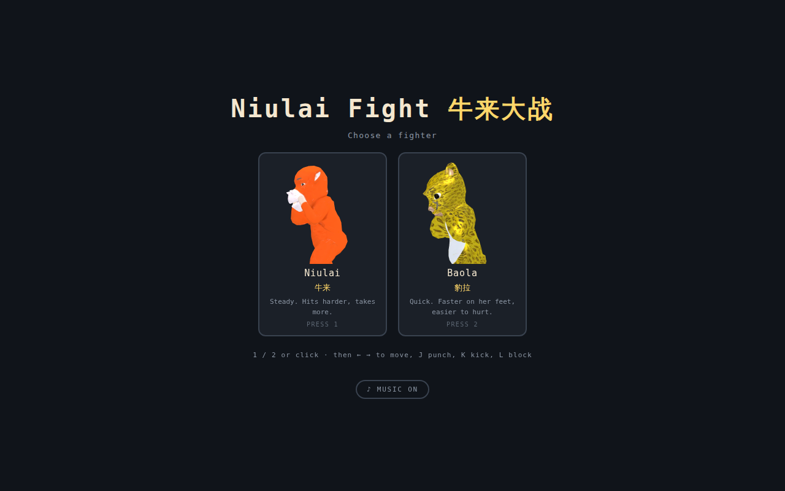
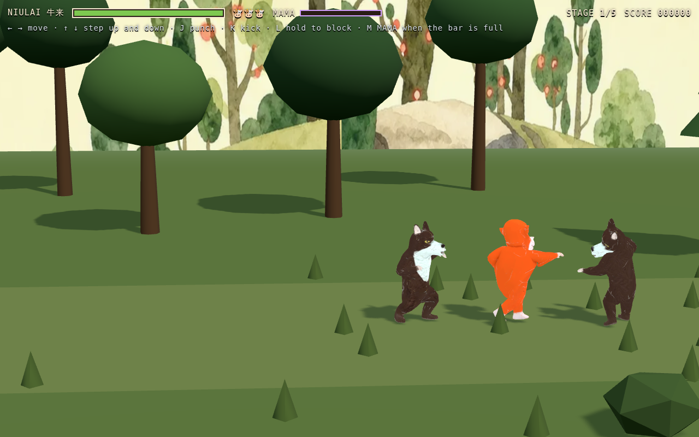
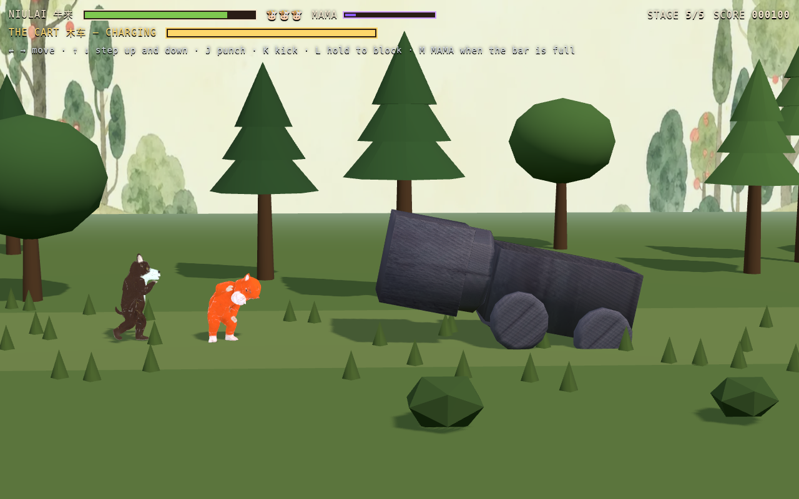
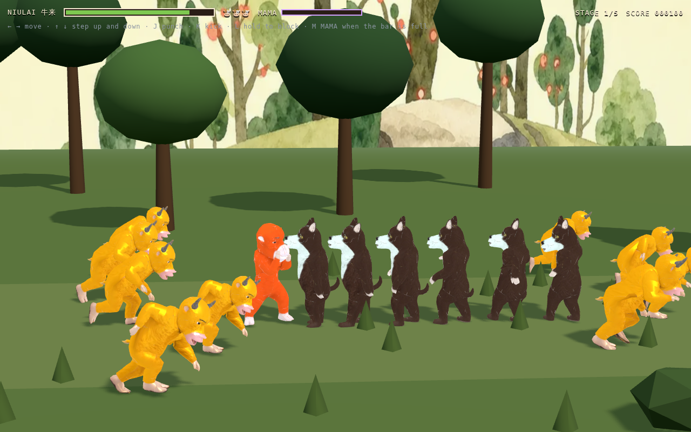
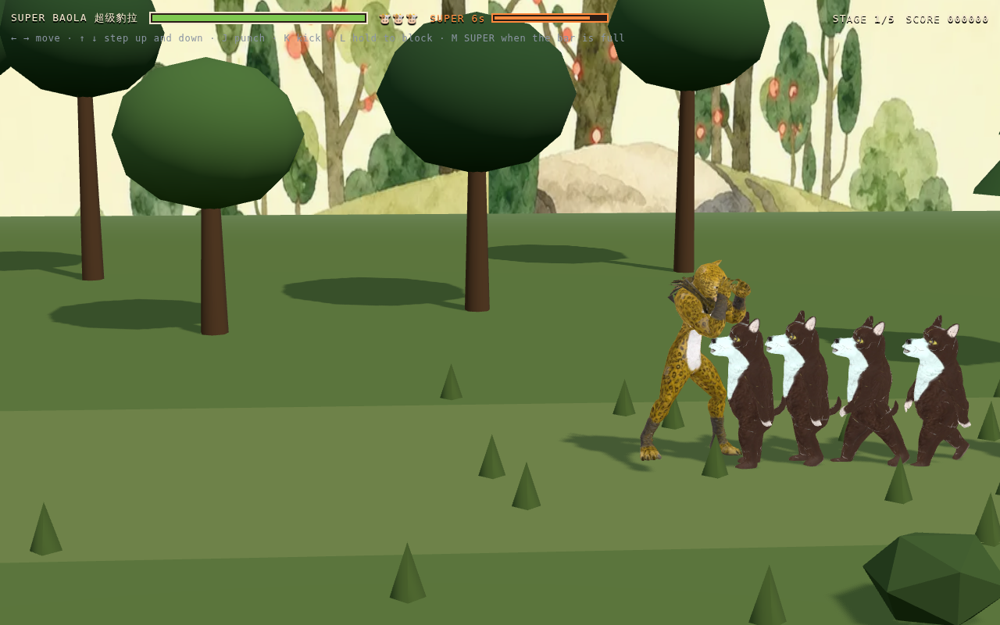
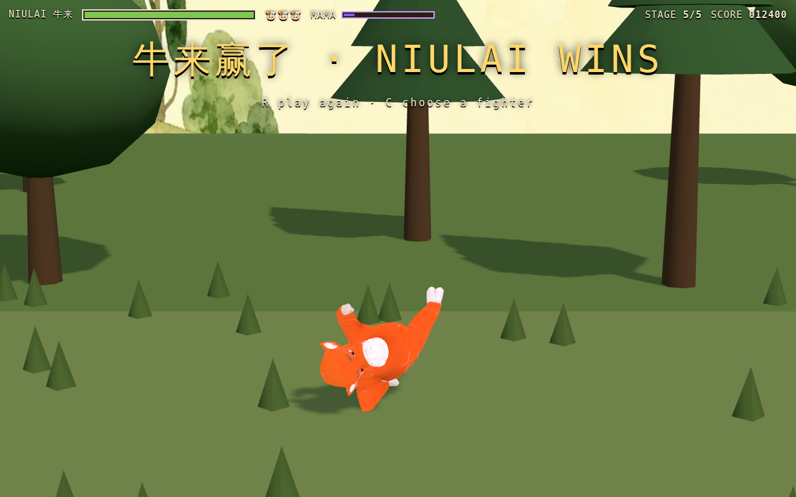

# Niulai Fight 牛来大战

A belt-scrolling brawler in the shape of the Famicom ones: walk right, the
screen stops, wolves arrive, clear them, the screen lets you on. Two fighters
to pick from — Niulai 牛来 and Baola 豹拉 — against Wolfwolf, who comes in
packs, through woods and grassland, and the Cart 木车 waiting at the end of it.
When Niulai has taken enough and given enough, he calls his mother, and ten of
her come through the field.

Runs as a Chrome extension. Click the toolbar button and it opens in a tab.









## Playing it

Pick a fighter first. **Niulai** is steady — more health, hits harder.
**Baola** is quick — faster on her feet and easier to hurt. Press **1** or
**2**, or click a card.

| | |
| --- | --- |
| **← →** | move |
| **↑ ↓** | step up and down the belt |
| **J** or **Space** | punch |
| **K** | kick |
| **L** or **Shift** (hold) | block |
| **M** or **U** | the super, when the rage bar is full — MAMA for Niulai, SUPER for Baola |
| **R** (when it ends) | play again |
| **C** (when it ends) | choose a different fighter |

Winning or losing does not send you back to the page reload button — the
banner tells you which key restarts, and a tap anywhere does it too.

Blocking works against what you are facing and not against what you are not,
which is what makes it a decision about where you are looking rather than a
button that turns damage off. A fifth of the damage still gets through, so
turtling cannot outlast a wave, and holding it costs your movement and your
offence.

Stepping up and down is not decoration. An attack only lands if you are close
in X *and* nearly level in Z, so a wolf standing a metre upstage cannot hit you
and you cannot hit it. Circling is how you fight three at once.

## Rage

**Both fighters have a meter**, both fill it the same way, and both spend it on
**M** — but what it buys is not the same move with different numbers, because
they do not have the same problem.

### Niulai: mama

Niulai has a meter. It fills from **both** halves of a fight — three and a half
for landing a hit, six for taking one, five for finishing a wolf — and when it
is full, **M** spends the lot. That is around seven wolves' worth, so it arrives
somewhere in the middle of the level rather than inside the first wave: a
screen-clearing move you spend because you need it, not because it is there.

He plants his feet, shouts for his mother, and ten of her come through the stage
in five parallel lines, running everything down. Every enemy in a lane is hit
once per cow that reaches it, which clears a screen of wolves outright and takes
about half the Cart's health, since the Cart is wide enough for several lanes to
find it at once.

They cross at 3.25 units a second — slower than the hero walks, and slow enough
to watch, which for the one spectacle in the game is the point. Their legs
follow: the gallop is scaled by how fast the herd is actually travelling against
the speed the clip was authored for, so slowing it down does not turn it into
skating.

Both that and the meter's fill rate live in the registry's `power` block, and
the tests read the herd until it is gone rather than for a fixed number of
seconds, so re-tuning either does not turn the suite red.

A cow retires after `range` units as well as on leaving the picture, and that
second rule is not belt-and-braces. The finish line is measured from the camera
and the camera follows the player — safe while the herd outran everyone, but at
less than walking pace a player heading right moves the line away faster than
the cows advance on it, and a cow that can never reach it never leaves the
scene. Ten more every cast, for ever.

The weighting is the design. Rewarding only aggression would withhold the button
from the player who is losing, which is exactly who needs it; rewarding only
damage taken would make the move a consolation prize. Both, tilted toward being
hit, means a bad exchange is still progress toward a good one. The second he
spends standing still is what it costs — and he is untouchable for that second,
because a super that a stray wolf can cancel is a super nobody uses when they
are surrounded, which is the only time it is worth using.

### Baola: seven seconds as something else

Hers does not touch the screen at all. She **becomes** something else —
Super Baola 超级豹拉, a jaguar warrior a third again her size — for seven
seconds: **double damage out, half damage in**, and no pause at all.



That last part is the design. Niulai's costs a second of standing still because
it answers being surrounded, and a screen-clear is worth paying for. Hers
answers the opposite problem — a fight she is losing on attrition, where what
she needs is not the screen cleared but a window in which trading hits is
finally in her favour. Locking her in place for it would spend the thing it
gives her.

The swap is of the actor, not the fighter: health, position, facing, the meter
and every rule about hitstun stay where they were, and only the body doing it
changes. The bar becomes a clock while it runs, in a different colour, so a
half-full bar never means two things.

**She grows into it.** The new body appears at exactly the size the old one was
standing at, eases up to its own over about half a second — overshooting a
little and settling, so it looks like something happening to her rather than a
slider being dragged — and eases back down before it hands her body back.
Appearing at full size on the swap frame read as a glitch instead of a
transformation: one frame a leopard cub, the next a jaguar warrior a third again
as tall, with nothing on screen connecting the two. Both the growth and the
shrink happen *inside* the seven seconds, so the number on the bar is the number
of seconds she is actually stronger for.

Which of the two a character gets is `kind` in the registry — `summon` or
`transform`. A character with no `power` block still gets no meter, no key and
no bar.

## Winning

Clear the fifth stage and the game stops being a fight. Niulai plants himself
and goes into a sweep kick and a backflip, on a loop, while the camera leaves
its fighting distance and comes in to watch — and the banner moves to the top of
the screen so the words are not standing on top of him.



It is the same `play()` every other state goes through, so the celebration is a
clip name in the registry and nothing more. **Baola has no celebration clip**,
and rather than freezing her in whatever the last thing she did left her in, she
falls back to her idle: `actor.has(state)` is what decides, and dropping the same
clip into her registry entry is all it would take to give her one.

Finding that out turned up a real bug, and an old one. `state` starts as `idle`
and `play()` returns early for the state it is already in — so the game's first
`play('idle')` was always a no-op and **no action ever started**. A character
that had not yet done something else stood in its bind pose: not breathing, not
swaying, a mannequin. Nothing caught it for as long as it existed because the
player walks within a second of starting and the wolves walk on arrival, so
almost everything asked for a *different* state before anyone looked at it. What
does not is a character standing still at the end of a won run.

## The Cart

The fifth stage is not more wolves. **The Cart 木车** rolls in with two of them,
and it has exactly one attack:

1. It follows you, slowly. Too slowly to catch anyone who keeps moving — it is
   not trying to catch you, it is trying to line you up.
2. It stops dead for **one second**, rears its nose up and shakes.
3. It charges straight down the belt at six times its rolling speed, and being
   hit costs a third of your health.
4. It overshoots, stalls for a second and a half, and takes **double damage**
   while it does.

That loop is the whole fight, and every part of it is there to make the attack
answerable. The charge holds the lane it committed to during the wind-up, so
the answer is to step off that line — the third axis the first four stages let
you ignore. Blocking works too and costs you a fifth of the damage, where
moving costs nothing. The stall afterwards is the only window worth punching
in, so the fight is a rhythm rather than a race.

It does not flinch. A punch hurts it without stopping it, because a boss a jab
could halt would make the whole thing a matter of mashing one button and never
moving.

## Installing it

Clone it, then in Chrome: **chrome://extensions** → turn on **Developer mode**
→ **Load unpacked** → choose this folder. The toolbar button opens the game.

No build step. `dist/bundle.js` is committed precisely so that works — a folder
you load unpacked has to be loadable unpacked, and requiring a build first
means a fresh clone fails with `ERR_FILE_NOT_FOUND` and a blank screen.

If you change anything under `src/`, rebuild it:

```bash
npm install
npm run build
```

`npm run package` builds `dist/niulai-fight-<version>.zip` for the Web Store.

To play it without the extension at all:

```bash
npm run serve      # then open the printed address
```

## The characters

**The four fighting bodies are rigged bipeds.** `npm run models` reads one folder
per character under `incoming/` and writes a single `.glb` each — 11 clips for
Niulai and Baola, 10 for Wolfwolf, around a megabyte apiece.

**The Cart is not.** It arrived as one static mesh with no rig and no clips at
all, which for a vehicle is not a shortcoming: its entire vocabulary is pitch,
roll and shake, and those are three lines each. `npm run prop` brings a model
like that in — re-encoding its textures, standing it on the floor and measuring
it — and `updateProp` in `actor.js` writes the motion. It still goes through
the same `play()` and `update()` as everything else, so nothing outside that
file knows which kind of actor it got.

**Mama is a rig with one clip.** She has no health, cannot be hit, and collides
with nothing — she is not a Fighter at all, just an actor that runs in a
straight line. `fallbacks` in the registry points every state the actor knows
about at the only clip she has, so nothing has to special-case an actor with a
vocabulary of one.

`npm run models` takes character names now, and it is worth using them:
re-exporting a character that has not changed still writes a byte-different
`.glb`, and a diff full of megabytes nobody altered hides the one that was.

The shout is **Opus in WebM**, not the m4a it arrived as. AAC plays in Chrome
and does not play in Chromium — no proprietary codecs in the open build — so the
move was silent for anyone not on Google's binary, and nothing said so. Both
test suites now check that the file has a duration, which is what "the browser
understood the container and the codec" looks like from JavaScript:

```bash
ffmpeg -i mama.m4a -vn -af "volume=10dB" -c:a libopus -b:a 64k -ac 1 assets/audio/mama.webm
```

Adding a fighter is a registry entry, not a code change: give it `playable:
true`, its clip trims and its stats, and it appears on the select screen with a
portrait rendered from the model itself. Baola went in that way, and reuses
Niulai's trims unchanged — the clips came from the same generator with the same
names, so the slices that worked for him work for her.

Super Baola is a registry entry too, and reuses Baola's clip trims unchanged:
same rig, same clip names, same rest height, a different mesh and a bigger
scale. Five clips rather than eight — no block, no knee, no jump — and
`fallbacks` covers the gap.

Re-texturing her goes through `npm run retexture` rather than the merge:

```bash
npm run retexture superbaola incoming/textures/superbaola.glb
```

A re-texture comes back as a *static* model — same mesh, new maps, no rig and
no clips — so dropping it into `incoming/` and re-merging would throw the
animations away. The maps move instead of the mesh: the rigged model keeps its
skeleton, its weights and every clip, and only its material changes. That works
because a re-texture is the same geometry with the same unwrap; the vertex
counts differ a little, since rigging splits seams, but UVs do not move. The
base colour and normal maps come across and the metallic-roughness one does
not — taking it would override the factors the animated export set and turn a
character that looked right into wet plastic.

The proof is a render, not an argument, so look at one. There is also a check
that the form can still play every state the game will ask it for, because a
re-texture that came back without the clips would leave her frozen in her bind
pose for seven seconds while every other check still passed — the damage
numbers belong to the Fighter and have nothing to do with whether anything is
moving.

A boss is a registry entry and a gate: `{ x, count, boss: 'cart' }` on the last
gate is what puts it there. Its size lives in the registry too, and it matters
more than it looks — the Cart is nearly three units long, so a hit box measured
centre to centre, which is how every other fighter is measured, would put its
middle further away than an arm can reach while its bodywork is in your face.
`hurtRadius` is what makes it hittable at all.

Locomotion speed follows actual ground speed, so nobody skates. Niulai uses the
**run** cycle because he covers about four body-heights a second; the wolves,
at 2.5, use the **walk** one. Niulai blocks and the wolves do not — that stays
the player's move.

Spare clips are merged and named but not yet bound to anything: hurdle,
back-jump and the wolf's jumping punch. Jumping needs an air state first; the
knee is an obvious heavy attack whenever a third button is wanted.

The placeholder path — a head model on a body built from primitives — is still
there for a character that has no rig yet. Set `animated: false` and it takes
over. Both kinds go through the same `play()` and `update()`, so they coexist.
[docs/MODELS.md](docs/MODELS.md) is the contract.

## Tests

```bash
npm test               # plays the game over http://
npm run test:extension # loads it as a real unpacked extension and plays it
```

Both drive the actual build through the same input a player uses, and read the
same state the HUD reads. That matters more than it sounds: a brawler can
render perfectly and still be broken in the only way that counts — a punch that
never connects, a gate that never opens — and none of that shows up in a
screenshot. Between them they check that walking reaches a gate, that the gate
holds you until the wave is dead, that a punch damages a wolf, that enough
punches finish one, that a wolf can hurt you, that clearing opens the gate, and
that a punch misses someone standing further up the belt.

Each super gets its own set. Niulai's: that the meter fills from hitting and
from being hit, that it will not fire early, that firing it empties the meter and plants
him in the summon pose, that ten of them arrive in parallel lines and all run
the same way, that nothing can touch him mid-summon, that a screen of wolves
does not survive it, that several of them land on the Cart at once because it is
wide enough for that, that the herd clears itself off the field, that the shout
is in a format the browser can decode. Baola's: that casting it turns her into
something else, that the new body takes over the old one's place in the scene
rather than a place beside it, that it runs for seven seconds and never holds
her still, that she hits for exactly twice and takes exactly half, that seven
seconds later she is entirely herself again, and that a round ending in the
middle of it puts her back.

The ending has checks of its own: that clearing the last gate plays the
celebration rather than stopping the frame, that the bones are still moving
afterwards, that the camera comes in, that the banner gets out of the way — and,
in the one place that can ask it, that a brand-new character animates before
anyone has asked it to do anything.

The boss gets its own set, and each one is the same question from a different
side — is its one attack answerable? That it pauses before it charges and does
not creep during the pause; that the charge holds its lane and is much faster
than its roll; that standing in it costs a lot and stepping off it costs
nothing; that blocking costs something in between; that a punch can reach it at
all; that hitting it hurts without stopping it; that it takes more damage while
stalled; and that wrecking it ends the game. Breaking any one of those on
purpose fails exactly the checks that name it — including the unhittable-boss
bug, which nothing else here would have noticed, because a boss that cannot be
hit simply never loses.

The extension suite exists separately because "works" and "works as an
extension" fail differently: a manifest naming a missing file, an asset the
extension's own CSP refuses to fetch. Those only show up when it is loaded the
way a player loads it.

## How it is built

```
src/
├── main.js            bootstrap, HUD, the frame loop
├── select.js          the character select, portraits and all
├── background.js      the extension: one click, one tab
└── game/
    ├── game.js        waves, gates, camera, the rules
    ├── fighter.js     health, hitstun, knockdown — shared by player and wolves
    ├── boss.js        the Cart: stalk, wind up, charge, stall
    ├── power.js       the rage meter and what it summons
    ├── actor.js       rigged models, props, and the placeholder body
    ├── stage.js       ground, trees, the painted backdrop
    └── input.js       keyboard and touch
```

Two decisions worth knowing:

- **The gate is the structure.** Without a boundary the player runs past every
  fight; with one the level becomes a sequence of small arenas. `boundary`
  stops the player and the camera at the same line, so the wall you run into
  is one the picture agrees with.
- **Attacks are buffered for a quarter of a second.** A press during hitstun
  or during the tail of your own last swing is held rather than dropped.
  Without it the game feels like it is ignoring you at exactly the moment you
  are pressing hardest.

## Permissions

None. The extension declares no permissions and no host access: it opens a tab
to a page inside itself, makes no network requests, and touches no other site.

The obvious refinement — focusing an already-open game instead of opening a
second tab — needs the `tabs` permission, which Chrome shows users as "read
your browsing history". Not a fair trade for a game.

## Licence

MIT for the code — see [LICENSE](LICENSE). The characters, their names and
their artwork are not covered by it; see [NOTICE.md](NOTICE.md).
